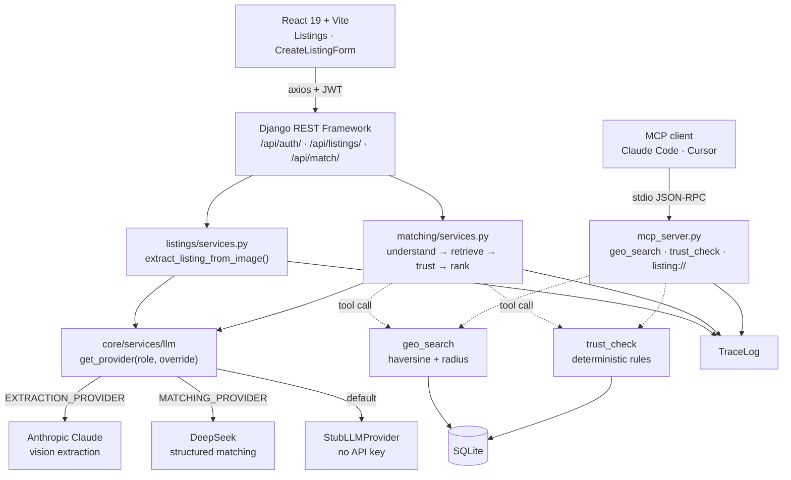
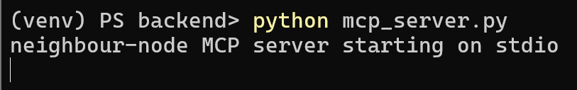
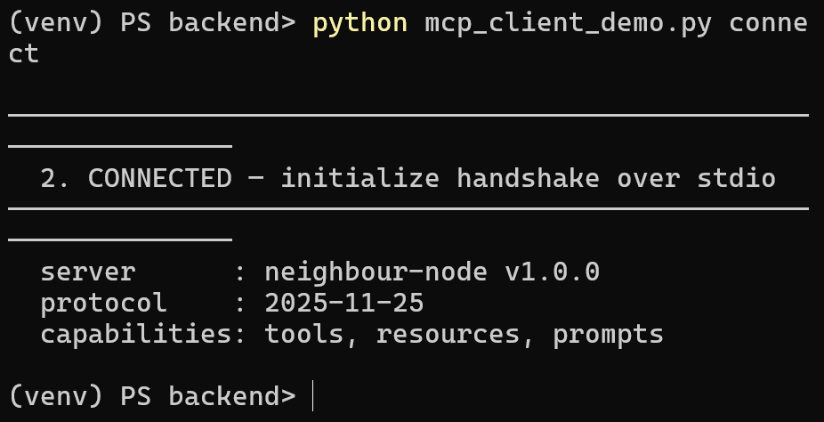
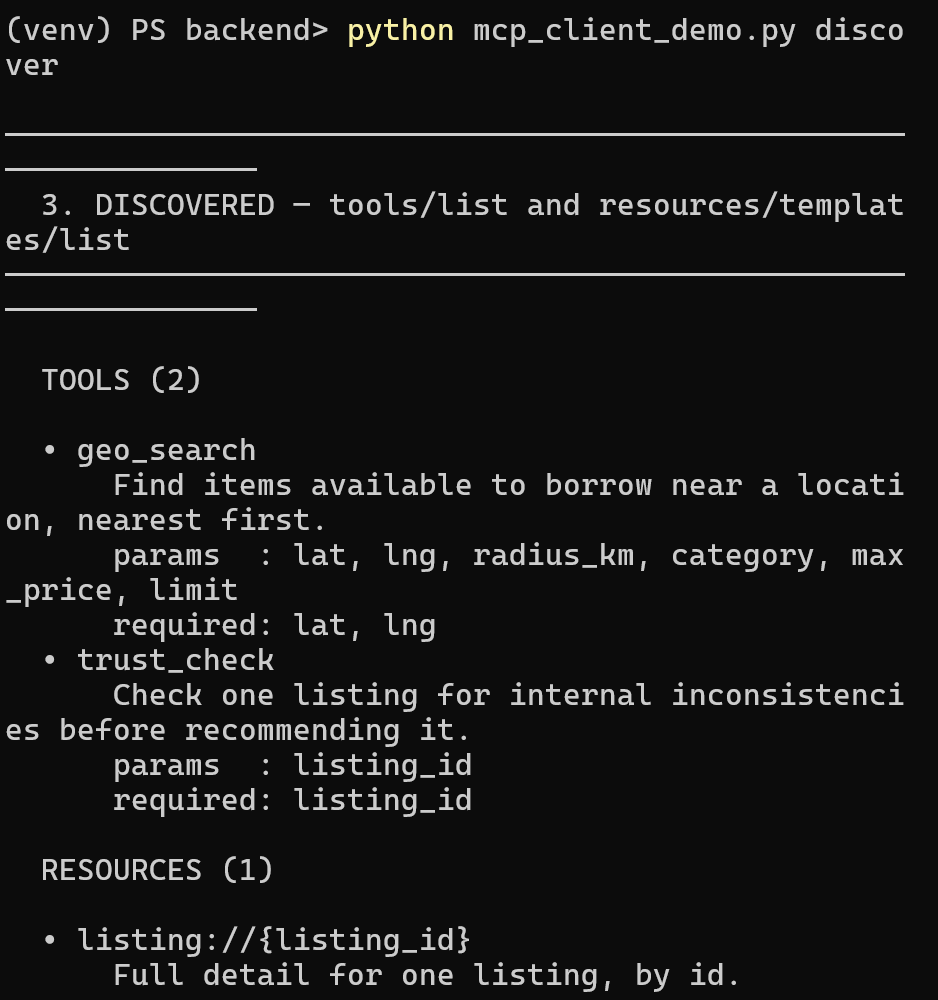
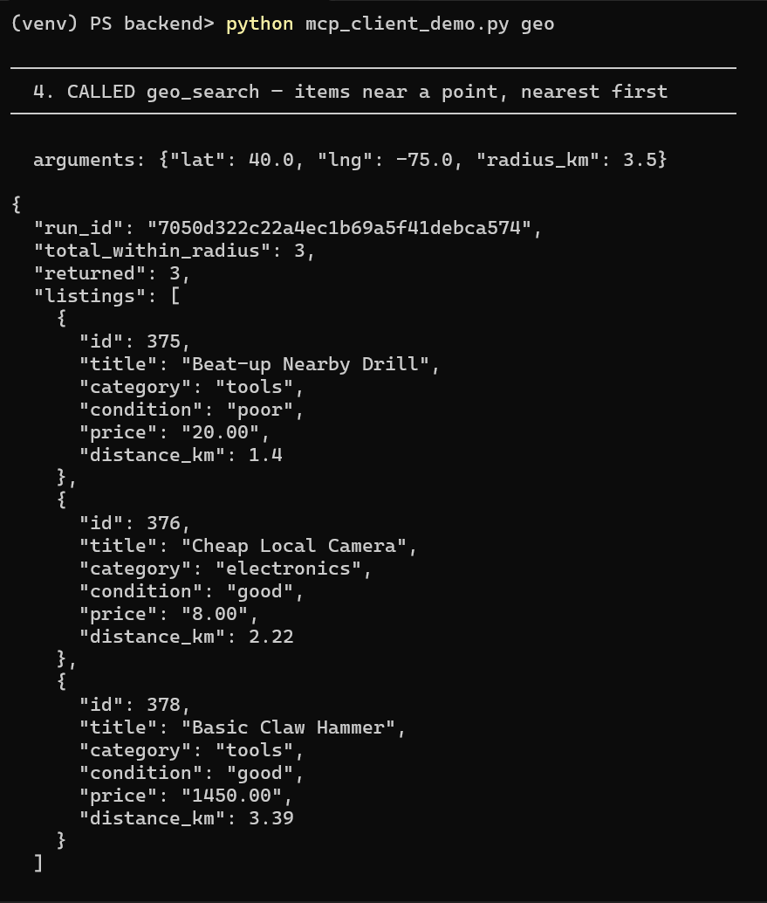
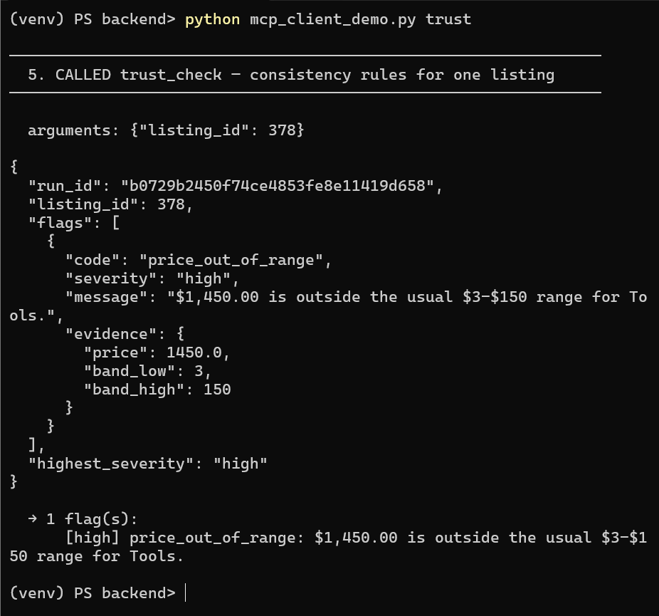

# Neighbour Node

An AI-assisted neighbourhood lending marketplace. Neighbours list items they're willing to
lend; others discover what's available nearby. The headline feature: snap a **photo of an
item** and an LLM drafts a structured listing — title, description, category, condition, and
a suggested price — which the lender reviews, edits, and posts.

Built **stub-first**: the entire pipeline runs end-to-end with a deterministic fake LLM and
**no API keys**, so the project can be cloned and run with zero paid setup.

- **Backend:** Django 6 + Django REST Framework
- **Frontend:** React 19 + Vite
- **Database:** SQLite (development)
- **AI:** pluggable LLM provider layer (stub today; Claude for vision extraction and DeepSeek
  for matching are wired by role, live API bodies pending)

---

## Features

- **Photo → listing extraction** — upload an item photo, get a validated draft listing back
  (async endpoint; image resize, prompt building, JSON parsing, schema validation, one capped
  retry, and 24h result caching).
- **Listings CRUD** — create, browse, update, delete; the lender is always set server-side
  from the authenticated user.
- **Bookmarks** — save a listing and browse what you've saved. Resource-style
  create/delete rather than a toggle, with bookmark state annotated onto listing
  payloads so a card can un-save without a lookup. See
  [docs/api-conventions.md](docs/api-conventions.md).
- **Geo-search** — Haversine great-circle distance to find listings within a radius,
  nearest-first, as a reusable standalone function.
- **Match agent** — a four-step graph at `/api/match/`: understand the free-text
  request → retrieve candidates by hard filters → trust-check them → rank with
  Markdown explanations. Per-user session memory (30 min TTL) turns a follow-up
  message into a refinement of the previous search.
- **Trust checks** — deterministic, rule-based flags on a listing's internal
  consistency: price outside its category's band, a title that disagrees with its
  category, a description too thin to be useful, a missing photo. Each flag carries
  a stable code, a severity and the evidence that fired it.
- **Match UI** — a search box that takes plain English ("something to help me move
  furniture on saturday"), and result cards showing the ranked listing, its distance,
  the agent's Markdown explanation, and its **concerns** — the trust flags rewritten by
  the model into plain language ("no photo available – you can't see the item"). An empty
  result is presented as an answer, not an error, because a real neighbourhood often has
  nothing that fits.
- **MCP server** — `geo_search` and `trust_check` exposed as MCP tools plus a
  `listing://{id}` resource, so any MCP client drives the same code the agent calls
  in-process.
- **JWT authentication** — register / login / refresh / "me".
- **Tracing** — every LLM call is recorded (run id, step, tool, timing, status) for
  observability and demos.
- **Role-based LLM providers** — extraction and matching resolve their model independently,
  so different jobs can use different back-ends (and the same query can be routed to two
  models for comparison).
- **Seed data** — a custom management command populates realistic + deliberately awkward
  sample listings (migrations stay schema-only).

---

## Architecture



The two AI paths — photo extraction and query matching — both go through one provider
registry, which resolves each **role** to a model independently. `geo_search` and
`trust_check` hang off the matching path as **tools**: plain callables the agent invokes
for hard distance filtering and rule-based checks, so the model never does arithmetic or
consistency-checking itself.

Those two tools are also the MCP server's entire surface. The server is a thin adapter —
**one implementation, two callers**. Whether a call arrives from the match agent
in-process or from an MCP client over stdio, it runs the same function and writes the
same `TraceLog` row, distinguished only by `agent_name`.

---

## Tech stack

| Layer | Choice | Why |
|---|---|---|
| API | Django 6.0, Django REST Framework 3.17 | ViewSets + serializers give CRUD, auth and permissions without hand-rolling them |
| Auth | djangorestframework-simplejwt (JWT) | Stateless tokens suit a separate React origin; no server-side session store |
| Config | python-decouple (`.env`) | Keys and secrets stay out of git and out of `settings.py` |
| AI schema | Pydantic v2 | `category`/`condition` reuse the Django model enums, so the LLM *cannot* return an invalid value |
| Images | Pillow | Resize/re-encode before upload — caps token cost and rejects non-images early |
| Sample data | Faker | Realistic volume for geo-search testing without hand-writing fixtures |
| Frontend | React 19, Vite, React Router, TanStack Query, axios | TanStack Query handles caching, refetch and loading state, so no Redux layer is needed |
| Database | SQLite (dev) | Zero setup for a fresh clone; Postgres deferred to deployment |
| CORS | django-cors-headers | React dev server runs on a different origin than the API |
| Formatting | black, isort (`--profile black`), ruff via pre-commit | Style is enforced automatically, never reviewed by hand |

---

## Project structure

```
neighbour-node-agent/
├── .mcp.json                   # MCP client config — points a client at the server
├── backend/
│   ├── config/                 # Django project (settings, urls, asgi/wsgi)
│   ├── apps/
│   │   ├── users/              # custom User model + JWT auth endpoints
│   │   ├── listings/           # Listing model, API, extraction service + schema
│   │   ├── bookmarks/          # Bookmark model + API (the join-row template)
│   │   ├── matching/           # match agent, geo-search, trust rules, session memory
│   │   ├── messaging/          # Conversation / Message models
│   │   ├── notifications/      # Notification model
│   │   └── core/               # LLM provider layer, tracing, validation, seed_data
│   ├── manage.py
│   ├── mcp_server.py           # MCP server (stdio) — run directly, not via manage.py
│   └── requirements.txt
├── frontend/
│   └── src/
│       ├── api/                # axios client + in-memory token store
│       ├── context/            # AuthContext
│       ├── hooks/              # TanStack Query hooks (useListings, useMatch)
│       ├── pages/              # Login, Signup, Listings, CreateListingForm, Match
│       └── components/         # Button, Icon, ListingCard, MatchCard, MatchExplanation
└── prompts.md                  # AI-interaction log
```

---

## Getting started

### Prerequisites
Python 3.12+, Node 20+, Git.

### 1. Backend

```bash
cd backend
python -m venv venv
# Windows (PowerShell):
venv\Scripts\Activate.ps1
# macOS/Linux:
# source venv/bin/activate

pip install -r requirements.txt
```

Create your `.env` from the template (`.env` is gitignored — never commit it):

```bash
cp .env.example .env
# Windows (PowerShell): Copy-Item .env.example .env
```

`SECRET_KEY` has no default — Django won't start until it's set. Any random string works
for development. The provider defaults are `stub`, so no API keys are needed.

Migrate, create an admin user, and seed sample data:

```bash
python manage.py migrate
python manage.py createsuperuser
python manage.py seed_data --clear
python manage.py runserver          # http://127.0.0.1:8000
```

### 2. Frontend

```bash
cd frontend
npm install
npm run dev                         # http://localhost:5173
```

Run both servers at once (two terminals). The React app calls the API at
`http://127.0.0.1:8000/api`; CORS is configured for `http://localhost:5173`.

---

## Configuration

| Variable | Purpose | Valid values | Default |
|---|---|---|---|
| `SECRET_KEY` | Django secret — **required**, no default | any string | — |
| `DEBUG` | Debug mode | `True` \| `False` | `False` |
| `EXTRACTION_PROVIDER` | LLM role: photo → draft listing | `stub` \| `anthropic` \| `deepseek` | `stub` |
| `MATCHING_PROVIDER` | LLM role: free text → search intent, ranking | `stub` \| `anthropic` \| `deepseek` | `stub` |
| `ANTHROPIC_API_KEY` | Claude key — only read if a role is set to `anthropic` | key string | empty |
| `DEEPSEEK_API_KEY` | DeepSeek key — only read if a role is set to `deepseek` | key string | empty |

With the defaults, the app runs entirely on the stub provider — no keys, no cost.

> **Both live providers work.** Switching a role off `stub` needs an API key and the
> client library, which are deliberately **not** in `requirements.txt` so a stub-only
> clone stays dependency-free and costs nothing:
>
> ```bash
> pip install anthropic   # for EXTRACTION_PROVIDER=anthropic
> pip install openai      # for MATCHING_PROVIDER=deepseek (OpenAI-compatible API)
> ```
>
> Costs are small but not zero: roughly **$0.0023** per photo extraction and a fraction
> of a cent per match. Note the result cache is per-process (see below), so a fresh
> script run re-pays for the same photo.

---

## Model selection rationale

Each role resolves its provider independently in
[`core/services/llm/__init__.py`](backend/apps/core/services/llm/__init__.py), so the two
jobs are matched to different models on their merits — and the same input can be routed to
two models for comparison via the `override` argument.

**Extraction → Claude (Haiku 4.5, `claude-haiku-4-5`).** The input is an *image*, which rules
out text-only models entirely, and the output must be schema-valid JSON. Of the five
extracted fields, four are easy: `title` and `description` are short, and `category` and
`condition` are constrained enums that the Pydantic schema validates against the Django
model choices. **`suggested_price` is the hard one** — pricing an item means identifying
what it is, often reading a brand or model off the object itself, and judging wear from the
photo. That is where vision quality actually shows up, and it is the field that makes the
feature useful rather than a captioner.

That reasoning originally argued for a frontier model, and it was tested rather than assumed.
Run live against three real photos, Haiku 4.5 read "Magic Bullet" off the logo unprompted and
graded a battered angle grinder `fair` ("visible signs of wear") while grading two clean items
`like_new`. Both of the capabilities the argument rests on — identifying the item and judging
wear — held on the cheapest vision tier. The prices it produced were wrong, but for a reason
that had nothing to do with the model: the prompt said "second-hand item" and asked for "a
number in USD", so it returned resale values. Rewording the field to *daily lending rate* took
a $25 blender to $3 with no model change. See `prompts.md` entries 46-47.

Two knobs, both matched to the tier:

- **Image input is capped at 1568px** on the long edge (`MAX_IMAGE_DIM`) — which is exactly
  the cap Haiku 4.5's vision tier is built around. (Opus 4.7+ reads up to 2576px, so the
  earlier pairing of a frontier model with a 1568 cap was paying frontier rates for
  lower-tier fidelity.)
- **No thinking, no `effort`.** Haiku 4.5 predates adaptive thinking, so omitting the
  `thinking` parameter means none — which is right for five short fields. `output_config.effort`
  is deliberately absent too: it is **rejected** on Haiku 4.5 and would 400.

That lands at roughly **$0.0023 per extraction** (~1,800 input / ~100 output tokens), about a
fifth of the frontier-tier cost.

> The 24-hour SHA-256 result cache is **per process**. With no `CACHES` block configured,
> Django uses `LocMemCache`, which lives in memory and dies with the process — so it saves
> repeat calls inside a running server, but a fresh script run re-pays for the same photo.

**Matching → DeepSeek (`deepseek-chat`).** This role is text-only — free text in, a
structured `MatchQuery` out, then ranking with Markdown explanations. It is structured
reasoning over short inputs, which DeepSeek does well at a fraction of frontier pricing.
It is also *not* a candidate for extraction: `deepseek-chat` has no vision.

### Two-model comparison

The `override` argument on `get_provider(role, override)` exists so the same input can be
routed to two models without touching settings. One query — *"I need a cordless drill for
the weekend, nothing over $50"* — through both, 3 runs each:

| | fenced responses | avg latency | returned the match |
|---|---|---|---|
| `deepseek-chat` | **0 / 6** | 5.76s | 2 / 3 runs |
| `claude-haiku-4-5` | **6 / 6** | 6.19s | 3 / 3 runs |

**Fencing is a property of the model, not the prompt.** Haiku wrapped its JSON in ```` ```json ````
on 12 of 12 calls across two unrelated prompts, both of which explicitly say not to; DeepSeek
did it on 0 of 9. So `strip_code_fences` is load-bearing for one provider and dead code for
the other — a fact that is invisible with only one live model, and the clearest argument for
keeping the provider layer role-based.

Haiku was also steadier on this query (identical 0.72 score every run, versus DeepSeek
drifting 0.7 → 0.55 → no match) and quantified its reasoning where DeepSeek stayed
qualitative. DeepSeek remains roughly 4× cheaper per token, so the cost argument above holds
— but the quality argument is not one-sided, and three runs of one query is not enough to
redesign around. Recorded as an open question rather than settled.

They also disagree on tokenisation: DeepSeek returns `keywords: ['cordless', 'drill']`,
Haiku returns `['cordless drill']`. Harmless today because `retrieve_candidates` filters on
price, radius and availability and never reads `keywords` — but it would become a
provider-specific bug the moment keywords drive filtering.

**Why the stub is the default.** Extraction failure modes (bad JSON, invalid enum, wrong
shape) are caught by `generate_and_validate`, not by the model, so the whole pipeline —
prompt building, parsing, validation, the capped retry, tracing — is exercised and testable
with a deterministic fake and zero spend. Live keys change *which* provider answers, not the
shape of the code around it.

---

## API endpoints

| Method | Path | Auth | Description |
|---|---|---|---|
| `POST` | `/api/auth/register/` | public | Create an account |
| `POST` | `/api/auth/login/` | public | Obtain access + refresh tokens |
| `POST` | `/api/auth/refresh/` | public | Refresh an access token |
| `GET`  | `/api/auth/me/` | JWT | Current user |
| `GET`  | `/api/listings/` | public (read) | List listings |
| `POST` | `/api/listings/` | JWT | Create a listing (lender = you) |
| `GET`/`PUT`/`PATCH`/`DELETE` | `/api/listings/{id}/` | public read / JWT write | Retrieve / update / delete |
| `GET`  | `/api/bookmarks/` | JWT | Your saved listings, each with the listing nested |
| `POST` | `/api/bookmarks/` | JWT | Save a listing (`{"listing": id}`). Idempotent — 201 on create, 200 if already saved |
| `DELETE` | `/api/bookmarks/{id}/` | JWT | Un-save. Someone else's bookmark 404s, never 403s |
| `POST` | `/api/listings/extract/` | JWT | Photo → draft listing (multipart `image`, optional `description`) |
| `POST` | `/api/match/` | JWT | Free text + `lat`/`lng` → ranked matches with explanations. Pass `fresh: true` to ignore session memory |

Authenticated requests use `Authorization: Bearer <access-token>`.

**API conventions.** Bookmarks is the first *join-row* feature — a row whose only job is to
connect a user to something else. Messaging threads and notifications are the same shape, so
the decisions were made once, deliberately, in the cheapest place to change them:
[**docs/api-conventions.md**](docs/api-conventions.md) has the nine rules and the reasoning
behind each — resource style over toggles, 404-not-403 via queryset scoping, owner from
`request.user`, idempotent create, annotate instead of per-row lookups, and the four tests
every private-row feature gets.

---

## How photo extraction works

1. Frontend uploads a multipart image to `POST /api/listings/extract/`.
2. The async view hands the bytes to the extraction service.
3. The service resizes the image, checks a SHA-256 cache, builds a prompt, and calls the
   role's LLM provider (`stub` by default).
4. The raw response is fence-stripped, JSON-parsed, and validated against a Pydantic schema
   whose `category`/`condition` reuse the Django model enums — so the AI can't return an
   invalid value. On a validation failure it retries once with the error fed back.
5. Every call is written to `TraceLog`. The validated **draft** is returned unsaved.
6. The lender reviews/edits and POSTs it to `/api/listings/` to create the real listing.

---

## MCP server

`backend/mcp_server.py` exposes the agent's two tools over the Model Context Protocol
(stdio transport), so an external client can drive them directly.

| Kind | Name | Purpose |
|---|---|---|
| Tool | `geo_search` | Items available to borrow near a point, nearest first. Optional `category` / `max_price` / `limit` |
| Tool | `trust_check` | Rule-based consistency flags for one listing, with severity and evidence |
| Resource | `listing://{id}` | Full detail for one listing |

**It is the same code the agent runs.** `geo_search` calls `matching.services.geo_search`
and `trust_check` calls `matching.trust.check_listing_by_id` — the tools reimplement
nothing. Every call writes a `TraceLog` row with `agent_name="mcp"`, so a filter on that
column shows exactly what arrived over the protocol, and a match run shows its own
`trust_check` step inline with the LLM calls.

Connect a client with the committed [`.mcp.json`](.mcp.json) — start it from the repo
root so the config is picked up:

```bash
cd neighbour-node-agent
claude          # then /mcp should show neighbour-node · connected
```

The paths in `.mcp.json` are absolute and Windows-specific; change them to match your
checkout. To run the server by hand (it will sit silently, waiting on stdin):

```bash
cd backend
python mcp_server.py
```

### Seeing it work

`backend/mcp_client_demo.py` is a small MCP client that spawns the server, completes the
handshake, discovers the tools off the wire, and calls two of them with fixed inputs
chosen against the seed data:

```bash
cd backend
python mcp_client_demo.py            # handshake, discovery, geo_search, trust_check
python mcp_client_demo.py discover   # or one step at a time: connect|discover|geo|trust
```

| | |
|---|---|
| [](docs/screenshots/01-server-running.png) | [](docs/screenshots/02-client-connected.png) |
| **1.** Server running on stdio | **2.** Client connected — handshake |
| [](docs/screenshots/03-tools-discovered.png) | [](docs/screenshots/04-geo-search-result.png) |
| **3.** Both tools and the resource, discovered | **4.** `geo_search` — 3 results, nearest first |
| [](docs/screenshots/05-trust-check-result.png) | |
| **5.** `trust_check` — one flag, with evidence | |

[**docs/mcp.md**](docs/mcp.md) has the exact command for each shot, why those demo inputs
were chosen, and how to pull the calls back out of `TraceLog`.

Two things that bite when working on it:

- **stdout is the transport.** A single `print()` corrupts the JSON-RPC stream and the
  client drops the server with no visible error. Diagnostics go to stderr.
- **Django must be configured before any model import** — `mcp_server.py` sets
  `DJANGO_SETTINGS_MODULE` and calls `django.setup()` before importing from `apps.*`,
  which is why those imports carry `# noqa: E402`.

---

## Database & migrations

Development uses SQLite. **Migrations are schema-only** — seed/initial data is provided via
the `seed_data` custom management command, never embedded as data migrations:

```bash
python manage.py seed_data --clear        # 40 random + 3 awkward-case listings
python manage.py seed_data --count 100    # custom volume
```

Column names and types are verified after each migration with a SQLite browser
(DB Browser for SQLite / DBeaver).

### SQLite in production too

The deployed container runs **SQLite, not Postgres** — deliberately, for a
single-node deployment:

- **One node, one worker process.** No multi-process write contention.
- **Database on a mounted volume**, so it survives container replacement.
- **WAL journal mode enabled**, which is what makes concurrent reads during a
  write safe.

At this scale — one writer, a few dozen listings — SQLite is not a compromise.
Two things would have to change before scaling out, and both are identified
rather than assumed:

1. The notification collapse filter uses a JSONField key lookup that compiles to
   SQLite's `json_extract()`; Postgres uses `jsonb` operators with slightly
   different semantics.
2. Extraction results are cached in `LocMemCache`, which is **per-process**. A
   second worker halves the hit rate, and every miss is a paid vision call.

The reasoning, the migration path and what was tested to protect it are in
[docs/decisions.md](docs/decisions.md).

---

## Development notes

- **Activate the virtualenv in every terminal** before running `manage.py`.
- The Python shell does **not** auto-reload edited modules — restart it after changes
  (`runserver` does auto-reload).
- Formatting is enforced by pre-commit (`black`, `isort --profile black`, `ruff`).

---

## Known limitations & next steps

- Messaging and notifications are models + migrations only — no API, no UI. Bookmarks is
  the built-out version of that same join-row shape, and
  [docs/api-conventions.md](docs/api-conventions.md) is the checklist those two should
  follow.
- Test coverage is **169 backend tests and 16 frontend**, measured with branch coverage:
  **76% overall, 91% on product code** excluding the demo scripts, seed command and MCP
  demo client. Composition, the known gaps and what coverage does *not* measure are in
  [docs/testing.md](docs/testing.md). The main remaining gaps are the two provider
  `generate()` methods, which need SDK mocking, and frontend rendering — pure logic is
  tested, anything needing a DOM is deliberately out of scope.
- Real geolocation. The match UI searches from a fixed point matching the seeded data,
  because browser geolocation would put a user nowhere near it.
- Persistent result cache. `LocMemCache` dies with the process, so the 24h extraction
  cache only helps inside a running server.
- Postgres, Docker, deployment.
