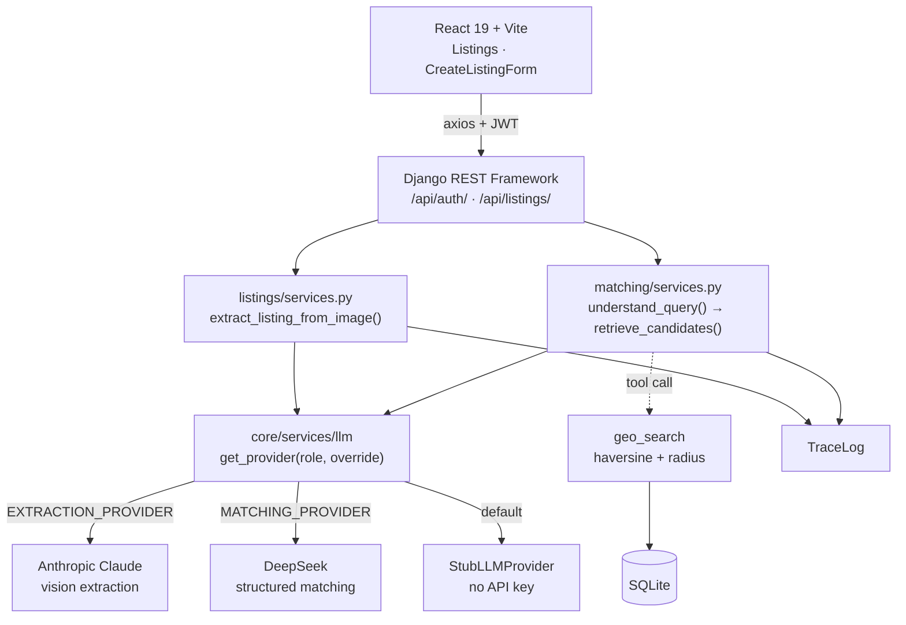

# Neighbour Node

An AI-assisted neighbourhood lending marketplace. Neighbours list items they're willing to
lend; others discover what's available nearby. The headline feature: snap a **photo of an
item** and an LLM drafts a structured listing — title, description, category, condition, and
a suggested price — which the lender reviews, edits, and posts.

Built **stub-first**: the entire pipeline runs end-to-end with a deterministic fake LLM and
**no API keys**, so the project can be cloned and run with zero paid setup.

- **Backend:** Django 6 + Django REST Framework
- **Frontend:** React 19 + Vite
- **Database:** SQLite (development)
- **AI:** pluggable LLM provider layer (stub today; Claude for vision extraction and DeepSeek
  for matching are wired by role, live API bodies pending)

---

## Features

- **Photo → listing extraction** — upload an item photo, get a validated draft listing back
  (async endpoint; image resize, prompt building, JSON parsing, schema validation, one capped
  retry, and 24h result caching).
- **Listings CRUD** — create, browse, update, delete; the lender is always set server-side
  from the authenticated user.
- **Bookmarks** — one-tap toggle endpoint per listing.
- **Geo-search** — Haversine great-circle distance to find listings within a radius,
  nearest-first, as a reusable standalone function.
- **JWT authentication** — register / login / refresh / "me".
- **Tracing** — every LLM call is recorded (run id, step, tool, timing, status) for
  observability and demos.
- **Role-based LLM providers** — extraction and matching resolve their model independently,
  so different jobs can use different back-ends (and the same query can be routed to two
  models for comparison).
- **Seed data** — a custom management command populates realistic + deliberately awkward
  sample listings (migrations stay schema-only).

---

## Architecture



The two AI paths — photo extraction and query matching — both go through one provider
registry, which resolves each **role** to a model independently. `geo_search` hangs off
the matching path as a **tool**: a plain callable the agent invokes for hard distance
filtering, so the model never does arithmetic itself.

---

## Tech stack

| Layer | Choice | Why |
|---|---|---|
| API | Django 6.0, Django REST Framework 3.17 | ViewSets + serializers give CRUD, auth and permissions without hand-rolling them |
| Auth | djangorestframework-simplejwt (JWT) | Stateless tokens suit a separate React origin; no server-side session store |
| Config | python-decouple (`.env`) | Keys and secrets stay out of git and out of `settings.py` |
| AI schema | Pydantic v2 | `category`/`condition` reuse the Django model enums, so the LLM *cannot* return an invalid value |
| Images | Pillow | Resize/re-encode before upload — caps token cost and rejects non-images early |
| Sample data | Faker | Realistic volume for geo-search testing without hand-writing fixtures |
| Frontend | React 19, Vite, React Router, TanStack Query, axios | TanStack Query handles caching, refetch and loading state, so no Redux layer is needed |
| Database | SQLite (dev) | Zero setup for a fresh clone; Postgres deferred to deployment |
| CORS | django-cors-headers | React dev server runs on a different origin than the API |
| Formatting | black, isort (`--profile black`), ruff via pre-commit | Style is enforced automatically, never reviewed by hand |

---

## Project structure

```
neighbour-node-agent/
├── backend/
│   ├── config/                 # Django project (settings, urls, asgi/wsgi)
│   ├── apps/
│   │   ├── users/              # custom User model + JWT auth endpoints
│   │   ├── listings/           # Listing model, API, extraction service + schema
│   │   ├── bookmarks/          # Bookmark model
│   │   ├── matching/           # Haversine + geo-search (match agent to come)
│   │   ├── messaging/          # Conversation / Message models
│   │   ├── notifications/      # Notification model
│   │   └── core/               # LLM provider layer, tracing, validation, seed_data
│   ├── manage.py
│   └── requirements.txt
├── frontend/
│   └── src/
│       ├── api/                # axios client + in-memory token store
│       ├── context/            # AuthContext
│       ├── hooks/              # data-fetching hooks (TanStack Query)
│       ├── pages/              # Login, Signup, Listings, CreateListingForm
│       └── components/         # Button, Icon, ListingCard
└── prompts.md                  # AI-interaction log
```

---

## Getting started

### Prerequisites
Python 3.12+, Node 20+, Git.

### 1. Backend

```bash
cd backend
python -m venv venv
# Windows (PowerShell):
venv\Scripts\Activate.ps1
# macOS/Linux:
# source venv/bin/activate

pip install -r requirements.txt
```

Create your `.env` from the template (`.env` is gitignored — never commit it):

```bash
cp .env.example .env
# Windows (PowerShell): Copy-Item .env.example .env
```

`SECRET_KEY` has no default — Django won't start until it's set. Any random string works
for development. The provider defaults are `stub`, so no API keys are needed.

Migrate, create an admin user, and seed sample data:

```bash
python manage.py migrate
python manage.py createsuperuser
python manage.py seed_data --clear
python manage.py runserver          # http://127.0.0.1:8000
```

### 2. Frontend

```bash
cd frontend
npm install
npm run dev                         # http://localhost:5173
```

Run both servers at once (two terminals). The React app calls the API at
`http://127.0.0.1:8000/api`; CORS is configured for `http://localhost:5173`.

---

## Configuration

| Variable | Purpose | Valid values | Default |
|---|---|---|---|
| `SECRET_KEY` | Django secret — **required**, no default | any string | — |
| `DEBUG` | Debug mode | `True` \| `False` | `False` |
| `EXTRACTION_PROVIDER` | LLM role: photo → draft listing | `stub` \| `anthropic` \| `deepseek` | `stub` |
| `MATCHING_PROVIDER` | LLM role: free text → search intent, ranking | `stub` \| `anthropic` \| `deepseek` | `stub` |
| `ANTHROPIC_API_KEY` | Claude key — only read if a role is set to `anthropic` | key string | empty |
| `DEEPSEEK_API_KEY` | DeepSeek key — only read if a role is set to `deepseek` | key string | empty |

With the defaults, the app runs entirely on the stub provider — no keys, no cost.

> **Live providers are not wired yet.** Both roles work end-to-end on `stub`. Setting a
> role to `anthropic` or `deepseek` currently raises `NotImplementedError` (the provider
> `generate()` bodies are skeletons), and needs the client library installed — those are
> deliberately not in `requirements.txt` so a stub-only clone stays dependency-free:
>
> ```bash
> pip install anthropic   # for EXTRACTION_PROVIDER=anthropic
> pip install openai      # for MATCHING_PROVIDER=deepseek (OpenAI-compatible API)
> ```

---

## Model selection rationale

Each role resolves its provider independently in
[`core/services/llm/__init__.py`](backend/apps/core/services/llm/__init__.py), so the two
jobs are matched to different models on their merits — and the same input can be routed to
two models for comparison via the `override` argument.

**Extraction → Claude (Opus 4.8, `claude-opus-4-8`).** The input is an *image*, which rules
out text-only models entirely, and the output must be schema-valid JSON. Of the five
extracted fields, four are easy: `title` and `description` are short, and `category` and
`condition` are constrained enums that the Pydantic schema validates against the Django
model choices. **`suggested_price` is the hard one** — pricing an item means identifying
what it is, often reading a brand or model off the object itself, and judging wear from the
photo. That is where vision quality actually shows up, and it is the field that makes the
feature useful rather than a captioner.

Two cost levers are deliberately left off:

- **Image input is capped at 1568px** on the long edge (`MAX_IMAGE_DIM`). Higher resolution
  roughly triples image tokens; it is worth raising only if the model is measurably
  misreading small text on items.
- **Extended thinking is off.** Filling five fields from a photo does not need multi-step
  reasoning, and thinking tokens bill at the (5×) output rate.

That lands at roughly **$0.012 per extraction** (~1,800 input / ~100 output tokens), and the
24-hour SHA-256 result cache means repeated development runs on the same photo cost nothing.

**Matching → DeepSeek (`deepseek-chat`).** This role is text-only — free text in, a
structured `MatchQuery` out, then ranking with Markdown explanations. It is structured
reasoning over short inputs, which DeepSeek does well at a fraction of frontier pricing.
It is also *not* a candidate for extraction: `deepseek-chat` has no vision.

**Why the stub is the default.** Extraction failure modes (bad JSON, invalid enum, wrong
shape) are caught by `generate_and_validate`, not by the model, so the whole pipeline —
prompt building, parsing, validation, the capped retry, tracing — is exercised and testable
with a deterministic fake and zero spend. Live keys change *which* provider answers, not the
shape of the code around it.

---

## API endpoints

| Method | Path | Auth | Description |
|---|---|---|---|
| `POST` | `/api/auth/register/` | public | Create an account |
| `POST` | `/api/auth/login/` | public | Obtain access + refresh tokens |
| `POST` | `/api/auth/refresh/` | public | Refresh an access token |
| `GET`  | `/api/auth/me/` | JWT | Current user |
| `GET`  | `/api/listings/` | public (read) | List listings |
| `POST` | `/api/listings/` | JWT | Create a listing (lender = you) |
| `GET`/`PUT`/`PATCH`/`DELETE` | `/api/listings/{id}/` | public read / JWT write | Retrieve / update / delete |
| `POST` | `/api/listings/{id}/bookmark/` | JWT | Toggle bookmark |
| `POST` | `/api/listings/extract/` | JWT | Photo → draft listing (multipart `image`, optional `description`) |

Authenticated requests use `Authorization: Bearer <access-token>`.

---

## How photo extraction works

1. Frontend uploads a multipart image to `POST /api/listings/extract/`.
2. The async view hands the bytes to the extraction service.
3. The service resizes the image, checks a SHA-256 cache, builds a prompt, and calls the
   role's LLM provider (`stub` by default).
4. The raw response is fence-stripped, JSON-parsed, and validated against a Pydantic schema
   whose `category`/`condition` reuse the Django model enums — so the AI can't return an
   invalid value. On a validation failure it retries once with the error fed back.
5. Every call is written to `TraceLog`. The validated **draft** is returned unsaved.
6. The lender reviews/edits and POSTs it to `/api/listings/` to create the real listing.

---

## Database & migrations

Development uses SQLite. **Migrations are schema-only** — seed/initial data is provided via
the `seed_data` custom management command, never embedded as data migrations:

```bash
python manage.py seed_data --clear        # 40 random + 3 awkward-case listings
python manage.py seed_data --count 100    # custom volume
```

Column names and types are verified after each migration with a SQLite browser
(DB Browser for SQLite / DBeaver).

---

## Development notes

- **Activate the virtualenv in every terminal** before running `manage.py`.
- The Python shell does **not** auto-reload edited modules — restart it after changes
  (`runserver` does auto-reload).
- Formatting is enforced by pre-commit (`black`, `isort --profile black`, `ruff`).

---

## Roadmap

- Live Claude API call for extraction (provider body currently a skeleton).
- DeepSeek matching & ranking agent (multi-step retrieval + Markdown explanations).
- `CreateListingForm` to close the lender flow end-to-end.
- MCP server exposing geo-search and trust-check tools with session memory.
- Messaging, notifications, and bookmark frontend.
- Test suite to 70%+ coverage, Docker, UX pass, final docs.
