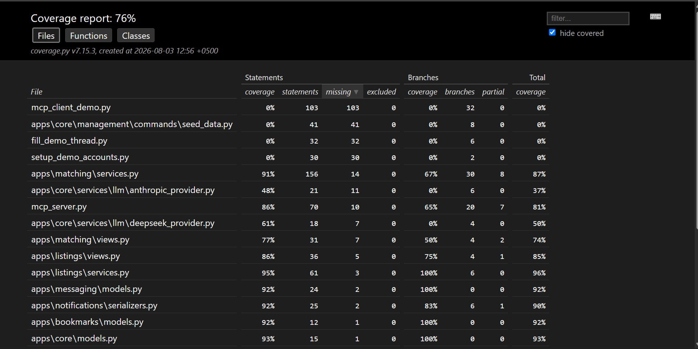
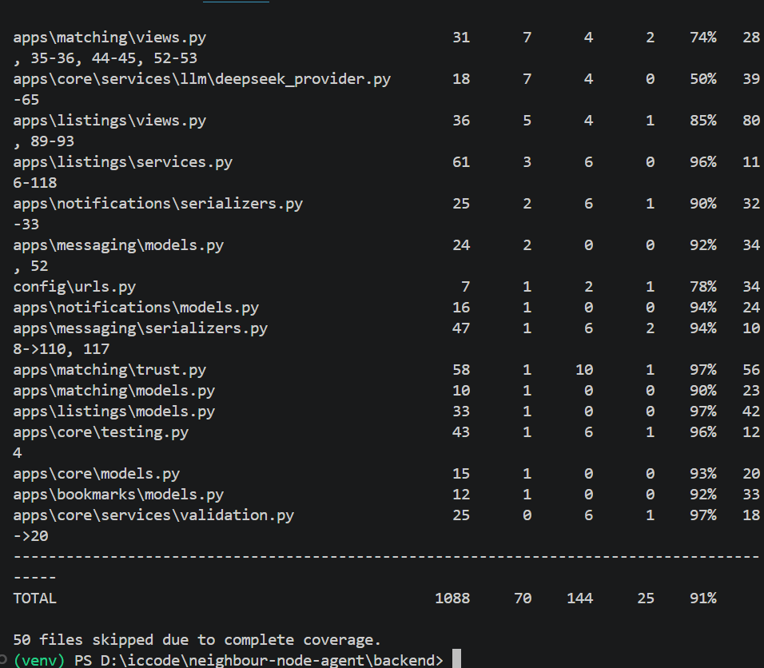

# Testing: reach, composition, and what it doesn't measure

Two numbers and a breakdown, recorded the day they were measured rather than
reconstructed from the file tree later.

## Coverage

Branch coverage, not statement coverage — every permission check and
notification guard in this project is an `if` whose true side runs constantly
and whose false side may never have been exercised. Statement coverage reports
those as fully covered the first time the line executes.

| | Baseline | Final |
|---|---|---|
| **Overall** — everything under `backend/` | 64% | **76%** |
| **Product code** — excluding demo scripts, the seed command and the MCP demo client | 78% | **91%** |

Both figures are quoted because neither is honest alone. The overall number is
depressed by four hand-run files that will never have tests — `mcp_client_demo.py`,
`setup_demo_accounts.py`, `fill_demo_thread.py` and the `seed_data` management
command, together 206 statements at 0%. The product figure excludes exactly
those four, named in words, and nothing else.

**`.coveragerc` omits six categories and no more:** migrations, settings,
wsgi/asgi, `manage.py`, test files, and the venv. The demo scripts were briefly
added to that list and then removed — the reasoning is in `prompts.md` entry 64,
but the short version is that an exclusion needing an argument costs more than
the points it buys.

Regenerate with:

```bash
cd backend
coverage run manage.py test apps

# Overall, gaps only — 100% files collapse into a "N files skipped" line.
coverage report --skip-covered

# Product only. The exclusion is spelled out rather than hidden in config,
# so the number and what it leaves out travel together.
coverage report --skip-covered --omit="mcp_client_demo.py,fill_demo_thread.py,setup_demo_accounts.py,apps/core/management/commands/seed_data.py"

coverage html && start htmlcov/index.html
```

| | |
|---|---|
| [](screenshots/06-coverage.png) | [](screenshots/07-coverage-product.png) |
| **76% overall** — the HTML report, branch coverage on | **91% product** — 50 files skipped at 100% |

## Composition

Reach and composition are separate claims. 169 backend tests, 16 frontend.

| Kind | Count | Where |
|---|---|---|
| **Service-level unit** | ~62 | trust rules, match agent steps, extraction + caching, notification services, geo-search |
| **API integration** (HTTP, through DRF) | ~92 | listings, bookmarks, messaging, notifications, permissions sweep, numeric precision |
| **End-to-end journey** | 1 | signup → login → photo→draft → create → search → ranked results, on a real bearer token |
| **MCP protocol** | 13 | tools and resource driven through an MCP client, not as bare callables |
| **Frontend logic** | 16 | `mergeMessages`, `notificationKinds` — `node:test`, no framework |

Notable within those:

- **Call-site tests on three services.** The trust annotator, the match
  notifier, and the message notifier each have a test that fails if the *call*
  is removed, separately from the tests that prove the service works.
- **Two demo-visible precision tests**, asserted through the HTTP response
  rather than the model, because that is where a rate loses its second decimal
  place.
- **A cross-app permission sweep** listing every protected endpoint in one
  table, so a viewset added later that forgets `permission_classes` fails a
  test that does not know it exists.

## What coverage measures, and what it doesn't

Coverage measures **reach** — was this line executed. It does not measure
**dependence** — does anything actually rely on this line being here.

The clearest demonstration came from the call-site audit. Eleven tests covered
`notify_listings_matched` thoroughly: the self-notify guard, the cap, the
collapse window, the payload shape, the query count. Every one of them passed
with the call **deleted** from `rank_candidates`. The service was perfect and
unreachable, and coverage was green throughout, because the tests called the
function directly.

The fix is a separate test that exercises the *call site*. Deleting that one
line now produces exactly one failure out of sixty-two, with the service suite
entirely green — which is the difference between "this code works" and "this
code runs".

Seven seams were audited this way: four trust rules, the extraction cache's read
and write, and the trust annotator. All were guarded. One diagnostic gap
surfaced: **removing the cache read and removing the cache write produce
identical failures**, so a break tells you the cache is broken but not which
half. Not a coverage gap — both are caught — but a reason to prefer
table-driven tests, whose `subTest` labels name the broken case immediately.

Branch coverage found something statement coverage could not: `IsOwnerOrReadOnly`
reported as fully covered while its anonymous check had only ever evaluated one
way. It was unreachable — the class is only ever composed with
`IsAuthenticatedOrReadOnly`, so an anonymous write returns 401 before object
permissions run. The right response was **deleting it**, not covering it, which
is the opposite of what a coverage target nudges you toward.

## Known gaps, stated rather than hidden

- **Provider `generate()` methods** — `anthropic_provider` at 37%,
  `deepseek_provider` at 50%. Both constructors and selection are covered; the
  network calls are not, and mocking two SDKs is a lot of scaffolding for code
  exercised live every day.
- **Frontend rendering** — no component tests. The pure logic that cannot be
  verified by clicking is tested; anything requiring a DOM or a mocked query
  client is deliberately out of scope in favour of API coverage.
- **`matching/views.py` validation branches** and **`listings/views.py` extract
  error paths** — the happy paths are covered end-to-end, the malformed-request
  branches are not.
